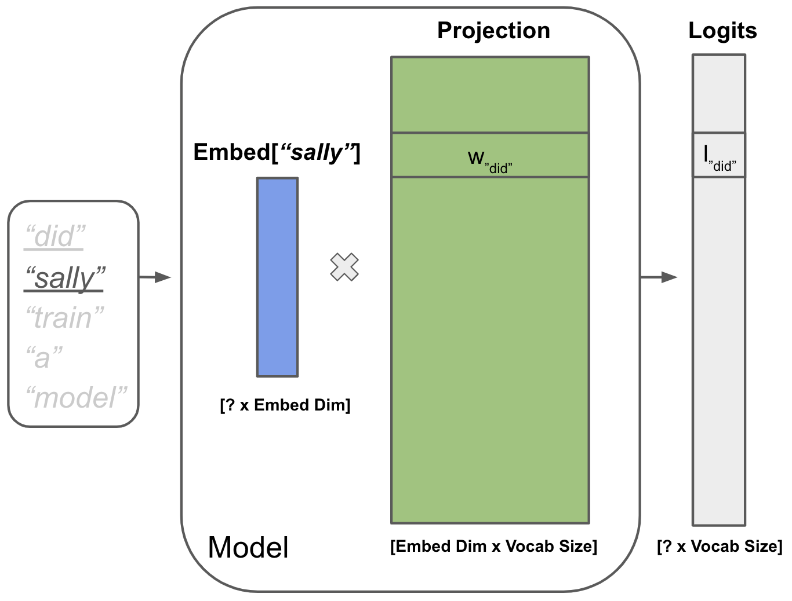

## Skip-gram Word2Vec

Here, you will train a neural network with the Skip-gram objective ([See 5.5.1 "The classifier"](https://web.stanford.edu/~jurafsky/slp3/5.pdf)) without explicit negative sampling but using cross-entropy loss instead. We have provided stencils for your model and training logic. **Please avoid modifying any of our stencil code. Doing so may break the autograder!**

You will need to submit your code, along with training curves from WandB and embedding plots in a separate write-up.

### Setup

When you open the `Word2Vec` folder, you should see the following files:

- `word2vec_utils.py` (provided) - Utilities for loading and preprocessing data, and embedding visualization.
- `model.py` (to fill in) - Model code.
- `train.py` (to fill in) - Training code.
- `sanity_check.py` (provided) - Testing script that you may use for sanity checking.

Debugging deep learning pipelines can be tricky, so we have provided `sanity_check.py` as a way to validate your basic model and dataset logic. Please note that these tests are not exhaustive, and do not ensure that your code will pass our autograder.

### Logic to Implement

You will need to write the following code. Once you have implemented 1), 2), and 3), you can run a basic code sanity check with:

```bash
# To test build_vocab, SkipGramDataset, and Model
python sanity_check.py
```

#### 1) `train.build_vocab()`

Before training neural networks on text data, we first need a way to map tokens to unique token ids. In this function, you will need to iterate over the training dataset, tokenize the text, and return a dictionary of `vocab_size` + 1 tokens (+1 because we include `<UNK>`), mapped to integers. Your mapping should only contain the most common tokens.

Please take a look at the functions and classes that we provide in `word2vec_utils.py`. You will want to use `tokenize()` here.

#### 2) `train.SkipGramDataset.__getitem__()`

You will also need to finish implementing the `SkipGramDataset`. Here, you need to write logic for extracting a tuple of integers (`input_idx`, `context_idx`) from a given text. This tuple of integers should correspond to tokens that are within `context_size` of each other. This involves tokenizing the text, sampling token indices, and converting the tokens to their token ids.

#### 3) `model.Model`

In `model.py`, you will need to implement a neural network with PyTorch. This model should contain a **learnable embedding** for each `token_id`, and use these embeddings to produce **logits** (un-normalized scores) for every token in the vocabulary. You will train this model to maximize the probability of the sampled context word, given an input token id. The reason we return logits, and not probabilities, is that our loss function will expect logits (for numerical stability).

We recommend the following architecture:


The following [PyTorch layers](https://pytorch.org/docs/stable/nn.html) may be useful:

- [`nn.Embedding`](https://pytorch.org/docs/stable/generated/torch.nn.Embedding.html)
- [`nn.Linear`](https://pytorch.org/docs/stable/generated/torch.nn.Linear.html)

Don't go overboard! We expect that **this model trains on CPU in under 10 minutes** (we tested a few configurations and find it can also be trained under 4 minutes)!

#### 4) `train.compute_loss()` and `train.train()`

To train your model, you will need to finish writing the `compute_loss()` and `train()` functions. This requires using your model to compute logits, and then using these logits and `target_ids` to compute your loss. Here, you should use [`nn.CrossEntropyLoss`](https://pytorch.org/docs/stable/generated/torch.nn.CrossEntropyLoss.html).

After using `compute_loss()`, `train()` should perform the training step to update the model parameters using the loss and ADAM optimizer.

At the end of each epoch, we also save plots of your word embeddings, projected into 2 dimensions with [TSNE](https://en.wikipedia.org/wiki/T-distributed_stochastic_neighbor_embedding) for visualization.

### Training

Once you have implemented the above code, you should be able to train your model with:

```bash
# to log training/validation loss to wandb, use `USE_WANDB=1`. Defaults to USE_WANDB=0.
USE_WANDB=0 python train.py
```

Please note that deep learning models are highly sensitive to training hyperparameters. Debugging these is a part of life, but if you feel stuck, feel free to reach out on Ed or come to TA hours!

### Visualizing Embeddings

Take a look at the visualizations saved in the `plots/` folder. You should be able to visually identify a few small word clusters that roughly correspond to differences in their syntax and semantics. If you do not see a few small clusters forming, you may need to adjust how you initialize your weights (and your hyperparameters).

You will need to include the first (epoch 0) and final (epoch N) word embedding plots saved to the `plots/` folder, and add a few sentences to your write-up describing several of the clusters.

---

**In order to receive full credit for this part of the assignment, you will need to**:

- Correctly implement `build_vocab()`, `SkipGramDataset`, `Model`, `compute_loss()`, and `train()`.
- Have a model that trains in < 10 minutes.
- Have a model that achieves a validation loss of < 5.1. If your validation loss is < 3, you should be very suspicious.
- Include screenshots of both your training and validation loss plots from WandB.
- Include your first (epoch 0) and final (epoch N) word embedding plots, and a short description of the characteristics of the different clusters that you observe in the final plot.
