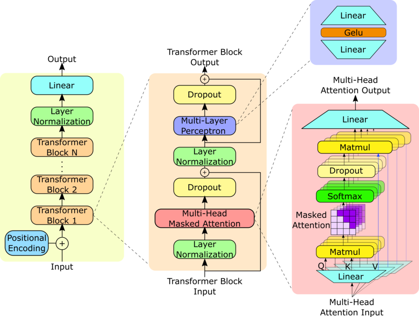

# COMS 4705 Spring 2026 Homework 2: Implement and Train Your Own GPT-2

## Overview

This homework has two parts: (1) implementing a **GPT-2 language model** from scratch, and (2) adapting that model to perform **text classification**.

You will cover the following topics in your GPT-2 implementation:

- Implementing a decoder-only transformer architecture from scratch using only Python and PyTorch, including:
    - Token and positional embeddings
    - Decoder-only Transformer blocks, including causal multi-head self-attention and MLP layers
    - A language modeling head for next-token prediction
- Implementing an auto-regressive generation function that supports:
    - Nucleus sampling with configurable temperature and top-p
    - Key-value caching to speed up generation
    - Batched generation to produce multiple sequences in parallel
- Verifying that your implementation can load the official PyTorch GPT-2 model checkpoint and is numerically consistent with the official GPT-2 implementation
- **No need to implement a tokenizer.** We provide pre-tokenized data for all experiments. The data is compatible with the official GPT-2 tokenizer and token embeddings, so you can use the token IDs directly as input to your model.

For the GPT-2-based text classification model, you will:

- Add a classification head on top of the GPT-2 language model
- Implement a training loop to fine-tune the GPT-2 classification model on the provided topic classification dataset
- Evaluate the fine-tuned model on a held-out validation set and report the classification accuracy

### No Hugging Face Transformers or Third-Party GPT-2 Implementations Allowed

You may not use any existing transformer libraries (such as Hugging Face Transformers) or any other third-party GPT-2 implementations. Your model architecture and training loop must be implemented from scratch using only PyTorch and standard Python libraries. You may also not use any existing GPT-2 code from online sources, including GitHub repositories or the source code of transformer libraries. **AI tools are permitted** in this assignment.

## Rationale

We recognize that implementing and training a GPT-2 model from scratch is a significant undertaking. We have included this assignment because it covers the most fundamental aspects of modern NLP: all of today's state-of-the-art LLMs are variants of the decoder-only transformer architecture that GPT-2 pioneered. By building it yourself, you will gain hands-on mastery of the core building blocks underlying modern language models.

We also want to remind everyone that this course explicitly allows the use of AI tools — including ChatGPT, Claude Code, Cursor, and GitHub Copilot — as long as you document their usage appropriately in your report. We encourage you to use these tools to deepen your understanding of the concepts covered here and to assist with implementation and debugging. Our goal is not only for you to understand the GPT-2 architecture and training process, but also for you to develop practical skills in using AI tools effectively.

## Getting Started

### Understanding the Project Structure

After downloading this homework assignment, unzip it with `unzip hw2.zip` and navigate to the `hw2` directory with `cd hw2`. Confirm that the following files are present:

```bash
.
├── checkpoints
│   └── gpt2_model.pth
├── data
│   ├── 20_newsgroups_train.jsonl
│   ├── 20_newsgroups_val.jsonl
│   └── openwebtext_1k_tokenized.jsonl
├── gpt-2.png
├── readme.md
├── requirements.txt
├── src
│   ├── gpt2.py
│   ├── __init__.py
│   └── train.py
└── tests
    ├── conftest.py
    └── hw2_test.py
```

Create a new Python virtual environment and install the required dependencies:

```bash
python -m venv venv
source venv/bin/activate
pip install -r requirements.txt
```

Next, take a look at the data in the `data` directory.

Each line of `data/openwebtext_1k_tokenized.jsonl` is a JSON object with the following format:

```json
{
  "idx": 0,
  "text": "Port-au-Prince, Haiti (CNN) -- Earthquake victims, ... ...",
  "token_ids": [
    13924,
    12,
    559,
    12,
    ...
    13
  ],
  "source": "OpenWebText",
  "tokenizer": "gpt2"
}
```

The `text` field contains the original text, and the `token_ids` field contains the corresponding token IDs from the official GPT-2 tokenizer. You can use these token IDs directly as input to your GPT-2 model in Part 1.

Similarly, each line of `data/20_newsgroups_train.jsonl` and `data/20_newsgroups_val.jsonl` has the following format:

```json
{
  "idx": 0,
  "text": "   >> conference calls?\n   >It's not Clipper, it's any encryption system. ...",
  "label": 11,
  "label_text": "sci.crypt",
  "token_ids": [
    220,
    220,
    9609,
    4495,
    3848,
    ...
    13
  ]
}
```

The `text` field contains the original text, `label` is the integer topic category, `label_text` is the human-readable label, and `token_ids` contains the GPT-2 token IDs. Your model should predict the correct `label` for each input sequence.

---

## Part 1: Implementing GPT-2 from Scratch

### Part 1 (a): GPT-2 Architecture and Forward Pass (15 Points)

#### Objective

In this part, you will implement a GPT-2 language model from scratch and verify that it can load the official GPT-2 checkpoint located at `checkpoints/gpt2_model.pth`.

You will need to implement the following components:

- Token and positional embeddings
- Decoder-only Transformer blocks, including causal multi-head self-attention and MLP layers
- A language modeling head for next-token prediction

You do not need to implement a tokenizer — use the pre-tokenized data provided in `data/openwebtext_1k_tokenized.jsonl` as input.

The GPT-2 model architecture is illustrated below:



Additional references if you would like to learn more about GPT-2 architecture:

- [The original GPT-2 paper](https://cdn.openai.com/better-language-models/language_models_are_unsupervised_multitask_learners.pdf)
- [The Illustrated GPT-2](https://jalammar.github.io/illustrated-gpt2/)
- [The Illustrated Transformer (general Transformer guide)](https://jalammar.github.io/illustrated-transformer/)

#### Implementation

Implement the GPT-2 model in `src/gpt2.py` using the provided `GPT2Config` class for all hyperparameters.

The `GPT2LMHeadModel` class is defined below. You must implement its `__init__` method to define and initialize the model architecture, and its `forward` method to compute output logits and return them as a `CausalLMOutput` object.

**You may not change** the class name `GPT2LMHeadModel`, the method signatures of `__init__` and `forward`, or the return type of `forward` — these are required by the autograder. You are free to add helper functions or classes, and to create additional source files in `src/` and import them in `src/gpt2.py`.

```python
class GPT2LMHeadModel(nn.Module):
    """
    GPT-2 Language Model with a language modeling head.
    This corresponds to HF's GPT2LMHeadModel.
    """

    def __init__(self, config: GPT2Config = GPT2Config(), bin_path: Optional[str] = None):
        """
        Initialize GPT-2 Language Model.
        
        Args:
            config: GPT2Config object containing model configurations.
            bin_path: Path to the pytorch_model.bin file. If empty or None, 
                      weights will not be loaded from file.
        """
        super().__init__()
        
        # TODO: define and initialize the GPT-2 model architecture here. 
        # If the `bin_path` argument is provided, 
        # load the model weights from the specified file path.
        # If `bin_path` is empty or None, do not load any weights, 
        # and initialize the model with random weights.
        pass

    def forward(
        self, 
        input_ids: Tensor, 
        past_key_values: Optional[List[Tuple[Tensor, Tensor]]] = None,
    ) -> CausalLMOutput:
        """
        Forward pass of GPT-2.
        
        Args:
            input_ids: [batch_size, seq_len] token IDs
            past_key_values: Optional list of past key-value pairs for KV caching

        Returns:
            CausalLMOutput with logits
        """
        # TODO: implement the GPT-2 forward pass here. 
        # The forward pass should compute the output logits for all input tokens,
        # and also update the cached attention keys and values in place (reference passing) 
        # if `past_key_values` is provided.
        pass
        
        return CausalLMOutput(logits=logits)
```

Once you have implemented the architecture, run the following to verify it loads the checkpoint and performs a forward pass without errors:

```bash
pytest tests/hw2_test.py::test_loads_and_forward_pass -v
```

#### Hints

- GPT-2 uses the GELU activation function with tanh approximation. Use `F.gelu(x, approximate="tanh")`.
- The official GPT-2 checkpoint uses **transposed weights** for linear layers. Standard PyTorch `nn.Linear` has shape `[out_features, in_features]` and computes `x @ W^T + b`, but the checkpoint stores weights with shape `[in_features, out_features]` and computes `x @ W + b`. You will need to account for this.
- In GPT-2, the token embedding layer (`wte.weight`) and the language modeling head **share weights**. Make sure your implementation reflects this.
- You do **not** need to implement KV caching in this part. The `past_key_values` argument will be used in Part 1 (c); for now, you can safely ignore it.

To inspect the contents of the checkpoint, you can run:

```bash
python3 -c "
import torch
ckpt = torch.load('checkpoints/gpt2_model.pth', map_location='cpu')
print(f'Total parameters: {len(ckpt)}')
print()
for k, v in ckpt.items():
    print(f'{k}: {tuple(v.shape)}')
"
```

The table below summarizes the saved tensors in the checkpoint and their descriptions:

| Component | Shape | Description |
|-----------|-------|-------------|
| `wte.weight` | (50257, 768) | Token embeddings (vocab size × hidden dim). Also used for LM head weight sharing. |
| `wpe.weight` | (1024, 768) | Position embeddings (max seq len × hidden dim). |
| `h.{i}.ln_1.weight/bias` | (768,) | Pre-attention layer norm |
| `h.{i}.attn.bias` | (1, 1, 1024, 1024) | Causal attention mask |
| `h.{i}.attn.c_attn.weight/bias` | (768, 2304) / (2304,) | Combined QKV projection |
| `h.{i}.attn.c_proj.weight/bias` | (768, 768) / (768,) | Attention output projection |
| `h.{i}.ln_2.weight/bias` | (768,) | Pre-MLP layer norm |
| `h.{i}.mlp.c_fc.weight/bias` | (768, 3072) / (3072,) | MLP up-projection (4× d_model) |
| `h.{i}.mlp.c_proj.weight/bias` | (3072, 768) / (768,) | MLP down-projection |
| `ln_f.weight/bias` | (768,) | Final layer norm |

---

### Part 1 (b): Numerical Correctness (15 Points)

#### Objective

In this part, you will verify that your implementation is numerically consistent with the official GPT-2 implementation. The allowed tolerance is $10^{-4}$ — that is, the maximum absolute difference between token probabilities predicted by your model and those from the official implementation must be less than $0.01\%$ for all tokens.

#### Implementation

Run the following test to check numerical correctness:

```bash
pytest tests/hw2_test.py::test_probability_tolerance -v
```

If the test fails, debug and fix any discrepancies until it passes. If your Part 1 (a) implementation is already correct, you may pass this test without any additional changes.

Passing both `test_loads_and_forward_pass` and `test_probability_tolerance` means you have successfully completed Parts 1 (a) and 1 (b). You can then move on to the next part.

#### Hints

The output of `GPT2LMHeadModel.forward` is a `CausalLMOutput` object whose `logits` field is a tensor of shape `[batch_size, seq_len, vocab_size]`, containing the raw scores **before** softmax.

---

### Part 1 (c): Auto-Regressive Generation with Nucleus Sampling, KV Caching, and Batched Generation (20 Points)

#### Objective

In this part, you will implement an auto-regressive generation function for your GPT-2 model. The function must support:

- **Nucleus (top-p) sampling** with configurable temperature and top-p threshold
- **Greedy sampling** when temperature is set to `0.0` (always select the highest-probability token)
- **Key-value (KV) caching** to speed up generation
- **Batched generation** to produce multiple sequences in parallel

The **temperature** parameter is defined as:

$$p_i = \mathrm{softmax}\left(\frac{z_i}{T}\right)$$

where $z_i$ is the logit for token $i$ and $T$ is the temperature. Higher temperatures yield more diverse outputs; lower temperatures yield more focused, deterministic outputs. Setting $T = 0$ enables greedy sampling.

The **top-p** (nucleus) threshold is defined as:

$$\sum_{i=1}^{k} p_i \geq p$$

where $p_i$ is the probability of the $i$-th token in descending order of probability, and $p$ is the cumulative threshold. Only the top $k$ tokens whose cumulative probability reaches $p$ are considered during sampling.

#### Implementation

Implement the `generate` method in `src/gpt2.py` as a method of `GPT2LMHeadModel`. You should also implement KV caching in the `forward` method to support efficient generation. The return type is a `ModelOutput` object whose `sequences` field contains the input token IDs concatenated with the newly generated token IDs.

**Do not change the method signatures below.** You may add helper functions, classes, or additional source files in `src/` as needed.

```python
class GPT2LMHeadModel(nn.Module):

    def forward(
        self, 
        input_ids: Tensor, 
        past_key_values: Optional[List[Tuple[Tensor, Tensor]]] = None,
    ) -> CausalLMOutput:
        """
        Forward pass of GPT-2.
        
        Args:
            input_ids: [batch_size, seq_len] token IDs
            past_key_values: Optional list of past key-value pairs for KV caching

        Returns:
            CausalLMOutput with logits
        """
        # TODO: implement the GPT-2 forward pass here. 
        # The forward pass should compute the output logits for all input tokens,
        # and also update the cached attention keys and values in place (reference passing) 
        # if `past_key_values` is provided.
        
        return CausalLMOutput(logits=logits)
        
    def generate(
        self,
        input_ids: Tensor,
        temperature: float = 1.0,
        top_p: float = 0.95,
        max_new_tokens: int = 128
    ) -> ModelOutput:
        """
        Generate tokens autoregressively using KV caching.
        
        Args:
            input_ids: [batch_size, seq_len] starting token IDs
            temperature: Sampling temperature. If 0.0, use greedy sampling.
            top_p: Top-p (nucleus) sampling threshold
            max_new_tokens: Maximum number of new tokens to generate
        
        Returns:
            ModelOutput with `sequences` containing the generated token IDs
        """        
        # TODO: implement the generation method here. 
        # You should use the `forward` method to compute logits and update KV cache at each step.
        # You can assume the input sequences are always padded to the same length,
        # and the total sequence length (input + generated) will not exceed 512 tokens.
        # GPT-2 does not have a stop token,
        # so you should always generate `max_new_tokens` new tokens 
        # for all the input sequences in the batch.
        
        return ModelOutput(sequences=input_ids)
```

After implementing `generate`, run the following tests to verify correctness:

```bash
pytest tests/hw2_test.py::test_greedy_sampling -v
pytest tests/hw2_test.py::test_nucleus_sampling -v
```

Passing both tests means you have successfully implemented auto-regressive generation with nucleus sampling and KV caching.

#### Hints

If you run into difficulties, consider implementing generation step-by-step — first getting a single greedy step working, then adding KV caching, then nucleus sampling, and finally batching.

---

## Part 2: GPT-2 for Text Classification

### Part 2 (a): Adapting GPT-2 for Text Classification (15 Points)

#### Objective

In this part, you will adapt your GPT-2 language model to perform text classification by adding a classification head on top of the base model. Other modifications to the GPT-2 architecture are also permitted. You should reuse the pre-trained GPT-2 base model weights whenever possible.

#### Implementation

Implement the `GPT2ForSequenceClassification` class in `src/gpt2.py`. You must implement the `__init__` method to define and initialize the model, and the `forward` method to compute classification logits and return them as a `SequenceClassifierOutput`. The dataset contains 20 topic classes, so the output logits should have shape `(batch_size, 20)`.

**You may not change** the class name, the method signatures of `__init__` and `forward`, or the return type of `forward`. You are free to add helper functions, classes, or additional source files in `src/`.

```python
class GPT2ForSequenceClassification(nn.Module):
    """
    GPT-2 Model with a classification head.
    """

    def __init__(self, 
                 config: GPT2Config = GPT2Config(), 
                 classifier_bin_path: Optional[str] = None,
                 lm_bin_path: Optional[str] = None):
        """
        Initialize GPT-2 Classification Model.
        
        Args:
            config: GPT2Config object containing model configurations,
                    including the number of labels.
            classifier_bin_path: Path to the 
                    This file should contain the weights for 
                    both the GPT-2 base model and the classification head.
                    If empty or None,
                    the classification head weights will be initialized randomly, 
                    and the base model weights may be initialized randomly 
                    or loaded from `lm_bin_path` if provided.
            lm_bin_path: Path to the pytorch_model.bin file for the language model.
                    This file should contain the weights for the GPT-2 base model.
                    If empty or None,
                    weights may be initialized randomly, 
                    or loaded from `classifier_bin_path` if provided.
        """
        super().__init__()

        # Only one of `classifier_bin_path` and `lm_bin_path` can be provided.
        assert not (classifier_bin_path and lm_bin_path), \
            "Only one of `classifier_bin_path` and `lm_bin_path` can be provided."

        # TODO: define and initialize the GPT-2 model that can be used for sequence classification.
        # You can reuse the GPT2LMHeadModel defined above as the base model,
        # and add a classification head on top of it.
        # You should also reuse GPT2LMHeadModel's weights to speed up training if possible.

    def forward(self, input_ids: Tensor) -> SequenceClassifierOutput:
        """
        Forward pass of GPT-2 for classification.
        
        Args:
            input_ids: [batch_size, seq_len] token IDs
        
        Returns:
            SequenceClassifierOutput with logits of shape (batch_size, num_labels)
        """
        
        # TODO: implement the forward pass for sequence classification here.
        # The output logits should be of shape (batch_size, num_labels),
        # where num_labels is specified in the GPT2Config,
        # and the logits contain the classification scores for each label class.
        
        return SequenceClassifierOutput(logits=logits)
```

After implementing `GPT2ForSequenceClassification`, run the following test to verify it loads and runs correctly:

```bash
pytest tests/hw2_test.py::test_classifier_loads_and_forward_pass -v
```

---

### Part 2 (b): Training Loop for Fine-Tuning (15 Points)

#### Objective

In this part, you will implement a training loop to fine-tune your GPT-2 classification model on the provided topic classification dataset, a subset of the 20 Newsgroups dataset. Your model must achieve at least **65% accuracy** on the held-out validation set.

You will need to:

- Load pre-tokenized training data from `data/20_newsgroups_train.jsonl`
- Train the model to predict the correct topic label for each input sequence
- Evaluate on the validation set at `data/20_newsgroups_val.jsonl` and report classification accuracy
- Log training loss and validation accuracy using TensorBoard or WandB, and include the resulting plots in your report
- Save your trained model checkpoint to `checkpoints/classifier_model.pth` and verify it loads without errors

#### Implementation

Implement your training loop in `src/train.py`. You may define any helper functions or classes in `src/train.py` or in additional files under `src/`. You have full freedom in how you design the training loop, as long as it fine-tunes and saves the classification model and achieves the required validation accuracy. Any training techniques are permitted, provided they do not rely on external data or model weights.

---

## Part 3: Report, Analysis, and Submission

### PDF Report (20 Points)
Include a report in PDF format named `report.pdf` at the **root level of the project folder**. Your report should contain the following sections:

1. **Implementation Status:** Describe which parts of the assignment you completed successfully, which parts were attempted but incomplete or contain errors, and which parts you were unable to attempt. Include a screenshot of the output from `pytest tests/hw2_test.py -v`.

2. **Training Techniques, Loss, and Validation Accuracy Curves:** Describe any training techniques you used to exceed 65% validation accuracy. Plot the training loss and validation accuracy curves using your TensorBoard or WandB logs (any plotting library is fine). Report the final validation accuracy.

3. **Challenges and Solutions:** Describe any challenges you encountered during implementation or training and how you addressed them. This can include bugs, conceptual difficulties, lessons learned, or anything else you found notable. This is an open-ended question — there are no wrong answers.

4. **AI Usage and Collaboration:** Describe how you used AI tools (e.g., ChatGPT, Claude Code, Cursor, GitHub Copilot) to assist with implementation or learning for this assignment. Also describe any collaboration with classmates. Use of AI tools is fully permitted and your answers will not affect your grade in any way.

### Submission Guidelines
Once you have completed all implementation and model training, as well as the report, run the full test suite to confirm your work one last time:

```bash
pytest tests/hw2_test.py -v
```

There are no hidden test cases — passing all tests in `hw2_test.py` means you have successfully completed all required components of this assignment.

**Submission:** Compress the entire `hw2` directory into a zip file using the folowing command. Make sure your resulting `.zip` submission is smaller than 1.0 GB.

```bash
# Delete the checkpoint/gpt2_model.pth to reduce file size. 
# This checkpoint file will be added back by our autograder.
rm checkpoints/gpt2_model.pth

zip -r hw2_yourUNI.zip hw2
```

Then, submit the assignment via this [Google Form](https://docs.google.com/forms/d/e/1FAIpQLScDGg-e2Bwgga70Jtj7jktDdABXruUrpA_m5ZfBK_FPC_hjIw/viewform?usp=header). 
