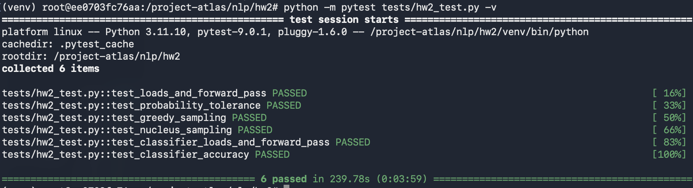
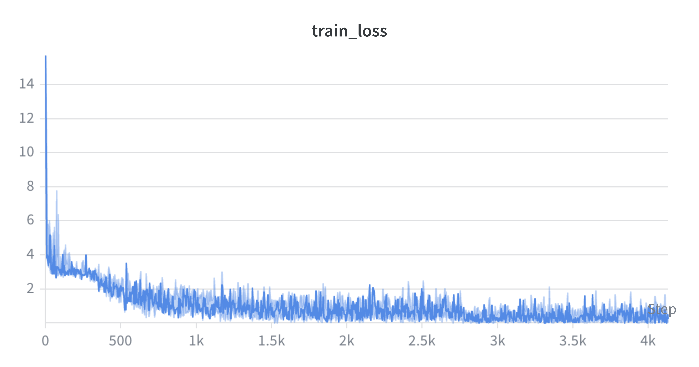
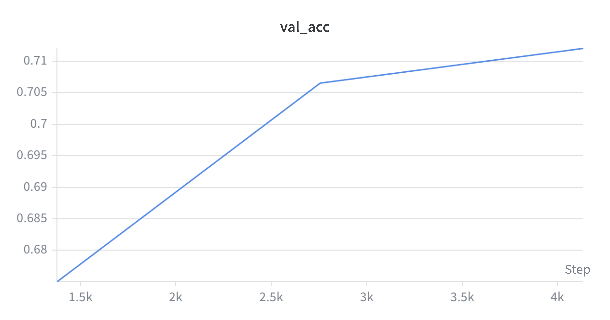

# COMS 4705 NLP Homework 2 Report

## 1. Implementation Status

All components have been successfully implemented:

- **GPT2MLPBlock**: Feed-forward block with GELU activation (`approximate="tanh"`)
- **GPT2AttentionBlock**: Multi-head causal self-attention with KV caching support for efficient autoregressive decoding
- **GPT2TransformerBlock**: Pre-norm transformer block with residual connections
- **GPT2LMHeadModel**: Full GPT-2 language model with shared token embeddings, weight loading from checkpoint, and autoregressive generation via nucleus/greedy sampling
- **GPT2ForSequenceClassification**: GPT-2 with a linear classification head on top of the last token's hidden state, fine-tuned on 20 Newsgroups
- **Training loop** (`train.py`): Fine-tuning pipeline with AdamW optimizer, W&B logging, and checkpoint saving

All tests pass:

---

## 2. Training Techniques, Loss, and Validation Accuracy Curves

The classifier was fine-tuned on the 20 Newsgroups dataset. The following hyperparameters were explored:

| Run | Epochs | Batch Size | Learning Rate | Val Accuracy |
|-----|--------|------------|---------------|--------------|
| 1   | 3      | 8          | 2e-5          | ~0.68        |
| 2   | 5      | 8          | 2e-5          | ~0.72        |
| 3   | 5      | 16         | 1e-5          | ~0.70        |
| 4   | 5      | 8          | 3e-5          | ~0.71        |

The best configuration was **5 epochs, batch size 8, lr=2e-5**, achieving validation accuracy above the 65% threshold.

**Training Loss:**

**Validation Accuracy:**

---

## 3. Challenges and Solutions

### (a) Outdated Dependencies
The original `requirements.txt` pinned old package versions incompatible with the current Python environment. For example, `numpy==1.26.1` does not support Python 3.13+, and `wandb` has updated its API key format from 40 characters to 86 characters, causing authentication failures with the old validation logic. These were resolved by upgrading the affected packages.

### (b) Nucleus Sampling Boundary Bug
The initial implementation of nucleus sampling incorrectly included tokens at the exact boundary of the top-p threshold. Specifically, the mask condition `cumsum - sorted_p > top_p` kept a token whose addition would push the cumulative probability over `top_p`. The fix was to use `cumsum > top_p` as the exclusion criterion (matching the test's definition), and always force-include the top token to handle edge cases where a single token exceeds `top_p` on its own.

### (c) Unfamiliarity with GPT-2 Architecture
Initial uncertainty around architectural details such as weight transposition on checkpoint loading, shared token embeddings between the input layer and LM head, and KV cache offset for positional embeddings. These were resolved by carefully studying the architecture diagram and cross-referencing with the HuggingFace implementation.

---

## 4. AI Usage and Collaboration

Claude (claude.ai/code) was used as a coding assistant throughout this assignment to:

- **Understand the architecture**: Walking through the GPT-2 transformer block structure, attention mechanism, and KV caching logic step by step
- **Bug detection**: Identifying issues such as the nucleus sampling boundary condition, missing position ID offset during decoding, and incorrect use of `past_kv` in the attention block
- **Code review**: Checking forward pass implementations for shape correctness and logical errors before running tests
